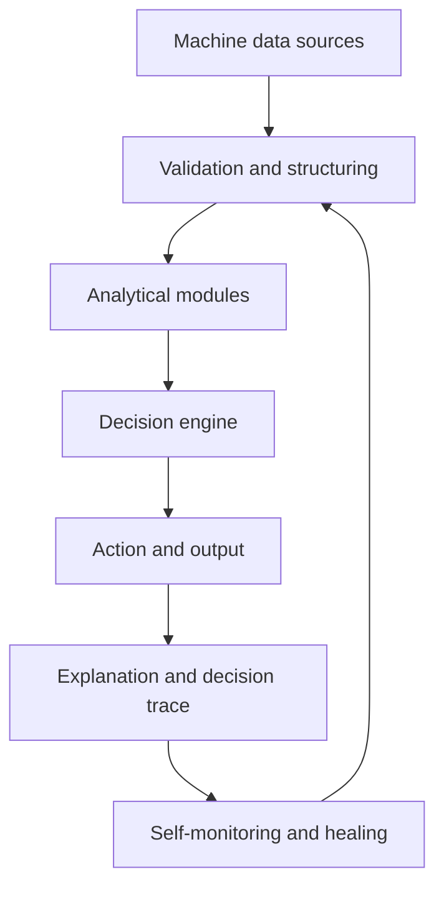

---

# Sovereign, Self-Healing AI (SSHAI)

---

## Core Definition

**Sovereign, Self-Healing AI is an autonomous architecture that ingests machine-level signals, transforms them into structured intelligence, and makes goal-directed decisions that explain themselves. It operates without human control, vendor lock-in, or proprietary hardware. It continuously self-heals when faults or anomalies appear, and optimizes flow for individuals and society alike. The result is a system that keeps itself healthy, and in doing so benefits every individual.**

[[Sovereign, Self-Healing AI Architecture Whitepaper](https://github.com/pablo-chacon/Sovereign-Self-Healing-AI/wiki/SSHAIA-Whitepaper)]

---

## Architecture overview

The flow begins with native machine data. It is validated, structured, and analyzed through domain-specific modules. The decision engine applies contextual logic aligned with goals and produces transparent results. Each action is output with its reasoning trace. A self-healing layer monitors the entire process, detects drift, and restores stability automatically.

---

## First Principles

**1. Sovereignty**
Every system must own its data, logic, and runtime environment. Dependence on external vendors, proprietary models, or closed infrastructures weakens autonomy and trust.

**2. Self-healing**
Recovery is continuous, not reactive. The system monitors its behavior, detects anomalies, and restores balance automatically.

**3. Machine-native processing**
Analytics are performed on structured, validated signals, never on raw human input or subjective interpretation.

**4. Transparency and traceability**
Every decision includes the reasoning, the evidence, and the context that led to it. Nothing operates as a black box.

**5. Purpose-driven intelligence**
Decisions are goal-oriented and measurable against outcomes. Intelligence exists to maintain systemic health.

**6. Modularity and independence**
Each component functions independently and reconnects once stable. There is no single point of failure or centralized control.

**7. Commodity hardware readiness**
All operations are designed for general-purpose hardware. Intelligence should depend on architecture and logic, not on computational privilege.

---

## Definition

Sovereign, Self-Healing AI refers to an autonomous intelligence system that operates independently of proprietary, centralized, or surveillance-bound infrastructures. It represents the next generation of ethical, lawful, and resilient artificial intelligence.

A system may truthfully claim the title of Sovereign, Self-Healing AI only when all of the following criteria are fully met.

**Hardware Agnostic**
The system must operate seamlessly on general-purpose hardware. It must not depend on proprietary chips, cloud-locked services, or specialized ecosystems.

**Decentralized and Federated**
The system must be designed for distributed operation with no single point of control. It must support jurisdictional independence across nodes and deployments.

**Self-Healing by Design**
The system must autonomously detect, respond to, and recover from faults, data anomalies, or interruptions. Human intervention must not be required to maintain operational integrity.

**Stateless Operation**
The system must not retain raw input data after processing, unless legally mandated. Minimal data footprint is an architectural default.

**Customer Controlled Data Storage**
All long-term data storage must remain under the deploying entity’s control. The AI processes data transiently and never retains it autonomously.

**Privacy-Respecting Architecture**
Processing is limited to anonymized, system-level, or environmental data. The system must be incapable of inferring personal identifiers by design.

**Encrypted and Unresolvable Session Context**
All identifiers must be encrypted and opaque. Only authorized entities can resolve relationships.

**Human-Optional Runtime**
The system must run continuously without human supervision. Manual oversight is optional, not required.

**Law-Aligned Deployment Model**
Compliance with major data protection frameworks such as GDPR, HIPAA, and LGPD must be native to its design.

**Inspectable and Auditable**
All operations, decision logic, and outputs must be transparent and auditable without compromising integrity.

**Immutable Operational Boundaries**
Capabilities are locked at design time. Repurposing for coercive or surveillance use requires structural re-engineering.

---

## Determinism and Human Out of the Loop

Sovereign, Self-Healing AI is deterministic and human-out-of-the-loop at runtime. Humans carry bias, therefore they cannot steer the system while it is operating. Decisions are made from machine-level data and predefined rules. Determinism ensures consistent outcomes from identical inputs. Self-healing ensures that if failures occur, the system detects, plans, and executes recovery to return to a stable state. In staying healthy, the system benefits everyone who depends on it.

---

## Individual Sovereignty within System Sovereignty

[UrbanOS](https://github.com/pablo-chacon/UrbanOS-POC) demonstrates this principle clearly. No two people move in the same way, even if they share destinations or schedules. Some walk faster, others slower. Some prefer bicycles, scooters, or ride-hailing. The architecture observes machine-level truths about each client, such as speed, recurring spatial patterns, and real-time infrastructure conditions. Clients are segmented by behavior, not demographics. This ensures that routing respects both personal behavior and system constraints. The result is collective harmony through natural alignment.

---

## Friction Reduction and Cultural Alignment

Individuals naturally seek the fastest and least effortful routes. When a majority uses an SSHAI-based planner such as UrbanOS, collective movement stabilizes, and friction decreases. Others adapt, and shared rhythms emerge. This mirrors real-world examples such as Tokyo, where commuters synchronize naturally without coercion. SSHAI therefore fosters efficiency, reduced friction, and shared cultural alignment, where individual optimization and system health reinforce each other.

---

## Real-World Examples

**[UrbanOS](https://github.com/pablo-chacon/UrbanOS-POC)**
UrbanOS applies SSHAI to urban mobility. It optimizes flow to ensure minimal delay for individuals and avoids congestion system-wide. Individual benefit and collective stability reinforce one another.

**Governance Applications**
A governance-scale system built on SSHAI would analyze historical data, identify sustainable strategies, and promote societal stability. Patterns leading to prosperity and fairness are reinforced, while harmful or regressive trends are phased out. Collective health becomes a measurable, adaptive process that benefits every individual.

---

## Creator

**Emil Karlsson**

**Patent**
Patent pending for the [Sovereign, Self-Healing AI Architecture](https://github.com/pablo-chacon/Sovereign-Self-Healing-AI/wiki/Sovereign,-Self%E2%80%90Healing-AI-Architecture). Unauthorized use or reproduction may infringe on patent rights.

**Contact**
[pablo-chacon-ai@proton.me](mailto:pablo-chacon-ai@proton.me)

---
